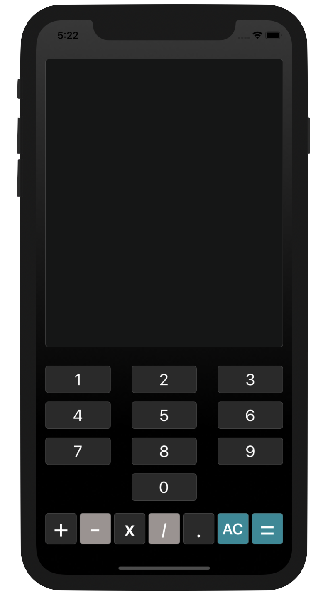

# Count0nMe

**Count0nMe** is a simple calculator iOS application in MVC architecture, that does basic calculus.

 

## Versions

Current version : V2.
Supports iOS 11+. 
Available in portrait and landscape mode, both on iPhone and iPad.
**Unit tests : ✓**

## Functionalities

- [x] Additions

- [x] Subtractions

- [x] Divisions

- [x] Multiplications

- [x] Operand priorities

- [x] Decimals

> Written with [StackEdit](https://stackedit.io/).
